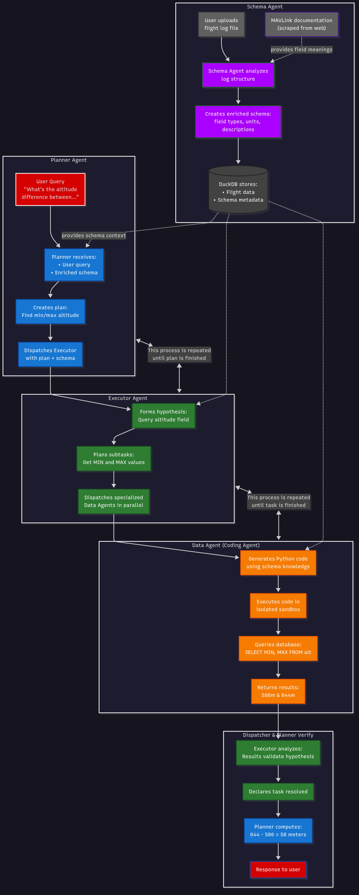

# UAV Log Viewer


A JavaScript-based log viewer for MAVLink telemetry and dataflash logs with an LLM-enabled analysis system that understands and answers questions about your flight data.

# UAV Log Viewer with Intelligent Analysis

A JavaScript-based log viewer for MAVLink telemetry and dataflash logs with an AI-powered analysis system that understands and answers questions about your flight data.

## System Architecture

This project uses a multi-agent AI system to analyze UAV telemetry data:

### Agent Hierarchy
Schema Agent => User Query => Planner Agent (Orchestration) => Executor Agent (Reasoning) => Data Agents (Parallel Execution) => Database (Flight Data)

### How It Works

**1. Data Setup**
- User uploads flight log file
- **Schema Agent** analyzes log structure and enriches it with field meanings from MAVLink/Ardupilot online documentation (scraped using beutifulsoup)
- System creates a database with telemetry data and metadata about what each field represents (units, types, descriptions)

**2. Question Answering**
- User asks a natural language question (e.g., "What was the maximum altitude?")
- **Planner Agent** receives the query and enriched schema, then creates a high-level analysis plan
- **Executor Agent** uses meta-reasoning to form hypotheses, plan subtasks, and dispatch specialized agents
- **Data Agents** generate and execute Python code in isolated sandboxes to query the database
- Results flow back up through the hierarchy to answer the user's question

### Key Features

- **Schema enrichment**: Automatically understands field meanings, units (mm, rad, degE7), and relationships
- **Intelligent reasoning**: Executor forms hypotheses and adapts strategy based on results
- **Self-healing execution**: Data agents retry with error correction if queries fail
- **Parallel execution**: Multiple data agents run simultaneously for complex analyses
- **Tool-based architecture**: Agents use function calling to control their own workflow

### Technology Stack

**Frontend**: Vue.js, Cesium for 3D visualization

**Backend**: 
- FastAPI (Python)
- OpenAI GPT-family
- DuckDB (embedded analytics database)
- E2B (code execution sandboxes)

**Agent Framework**:
- Planner: Creates semantic execution plans
- Executor: Meta-cognitive reasoning with hypothesis formation
- Data Agents: Code generation and execution
- Schema Agent: Field enrichment with MAVLink reference data

**Multi-Agent FLow Diagram**




## Build Setup
```bash
# initialize submodules
git submodule update --init --recursive

# install dependencies
npm install

# enter Cesium token
export VUE_APP_CESIUM_TOKEN=<your token>

# serve with hot reload at localhost:8080
npm run dev

# build for production with minification
npm run build

# run unit tests
npm run unit

# run e2e tests
npm run e2e

# run all tests
npm test


## Backend Setup

# navigate to backend directory
cd backend

# install Python dependencies
pip install -r requirements.txt

# set required environment variables
export OPENAI_API_KEY=<your OpenAI API key>
export E2B_API_KEY=<your E2B API key>

# run the backend server
python app.py
